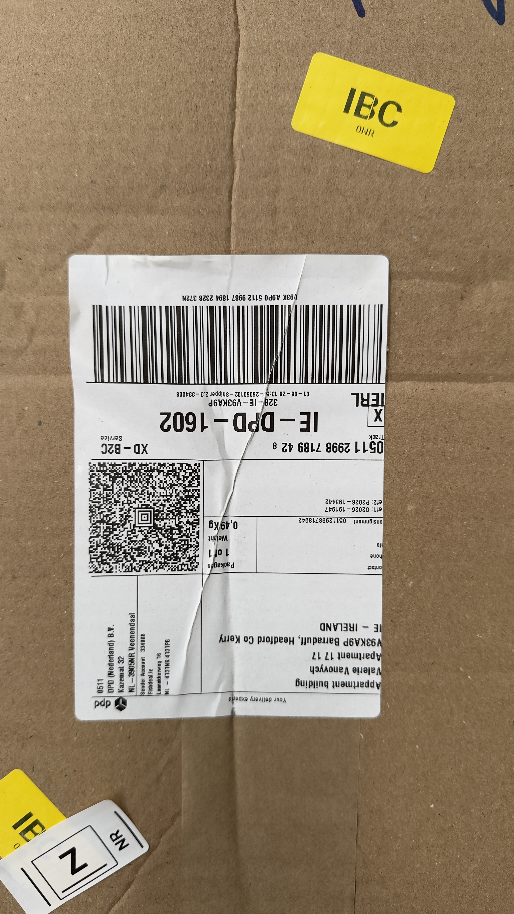

<div align="center">
  
  <h1>DPD Assistance</h1>
  <p><strong>Chrome Extension · Logistics Automation · AI-Powered</strong></p>

  
  
  
  
</div>

---

A Chrome Extension that automates repetitive logistics tasks at a DPD Ireland parcel depot — built to replace manual processes that previously took hours of clicking.

## What It Does

### Reschedule Future-Dated Parcels

Depot staff regularly receive parcels with future delivery dates that need to be manually rescheduled one by one in the depot management system. This extension automates that entire flow:

1. Opens the pending parcels list
2. Identifies which parcels have future dates (CAD-scanned)
3. Fetches each consignment detail
4. Calculates the next valid working day (skipping weekends + Irish bank holidays)
5. Submits the reschedule — all in one click

**Dry Run mode** lets you preview changes before committing anything.

### Scan Parcel Labels from Google Drive

When drivers photograph parcel labels and upload them to a shared Google Drive folder, the extension:

1. Lists all photos in the configured folder
2. Downloads each image and sends it to **GPT-4o Vision** for OCR
3. Parses the consignment number from 3 different DPD label formats:
   - Plain 9-digit number (e.g. `123456789`)
   - Slash format (e.g. `0123456789/0/1` → `123456789`)
   - 15-character barcode (e.g. `051112345678942` → `12345678942`)
4. Looks up each consignment in the depot system and reschedules
5. Moves processed label photos to a `Done` subfolder automatically

> **Real label example used during development:**
>
> 

### Gmail Auto-Reply *(in progress)*

Automatically reads incoming customer emails, extracts order/tracking data, queries the carrier API for shipment status, and generates a contextual reply using OpenAI — either as a draft or sent directly.

---

## Tech Stack

| Layer | Technology |
|---|---|
| Extension | Chrome MV3, `chrome.scripting`, `chrome.identity` |
| AI / OCR | OpenAI GPT-4o Vision |
| Auth | OAuth 2.0 via `chrome.identity.getAuthToken` |
| Storage | Google Drive API v3 |
| Email | Gmail API (readonly + compose) |
| UI | Vanilla JS, CSS (Apple-inspired design) |

---

## Architecture

```
src/
├── depot/
│   ├── depotScript.js      # Self-contained script injected into depot tab
│   ├── labelParser.js      # OCR number → clean consignment number
│   └── driveScanner.js     # Drive API + GPT-4o Vision pipeline
├── popup/                  # Extension UI (accordion, toggles, status)
├── gmail/                  # Gmail read/draft/send
├── ai/                     # OpenAI prompt builder + reply validator
├── auth/                   # OAuth token helper
├── config/                 # Centralised config facade
└── workflow/               # Email processing orchestrator
```

The depot script runs **inside the depot tab's page context** using `chrome.scripting.executeScript({ func, args })` — it reuses the existing session cookies, so no credentials need to be stored in the extension.

---

## Planned Features

- **Gmail Auto-Reply** — full end-to-end: read email → query carrier API → generate reply → send/draft
- **Configurable carrier adapters** — swap DPD for any other carrier API without changing business logic
- **Notification system** — Chrome notifications when batches complete or errors occur
- **Processing history** — local log of all rescheduled consignments with timestamps
- **Multi-depot support** — run against different depot accounts from the same popup

---

## Setup

1. Clone this repo
2. Open `chrome://extensions` → Enable **Developer mode** → **Load unpacked** → select the project folder
3. Open the extension popup → **Settings**
4. Enter your OpenAI API key and Google Drive folder ID (or paste the full Drive URL)
5. Ensure the Drive folder is shared with your Google account as **Editor**

> OAuth consent is handled automatically via the signed-in Chrome profile — no manual token setup needed.

---

## Why I Built This

I work at a DPD Ireland parcel depot. The internal management system has no batch-processing tools — every reschedule is a separate sequence of clicks. I built this extension to automate the repetitive parts so the team can focus on actual logistics work.

It's also a personal project to explore Chrome Extension architecture, OAuth flows, and practical applications of vision AI on real-world document images.

---

*Built with Chrome MV3 · OpenAI · Google APIs*
