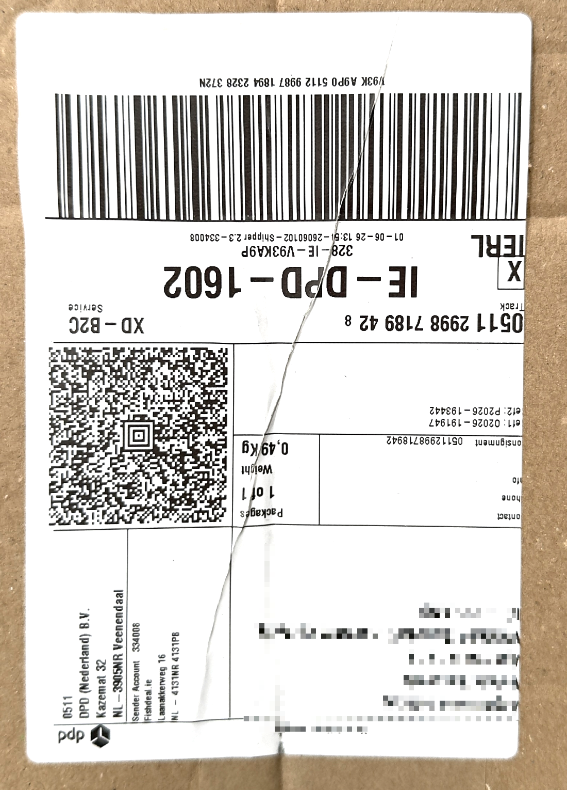
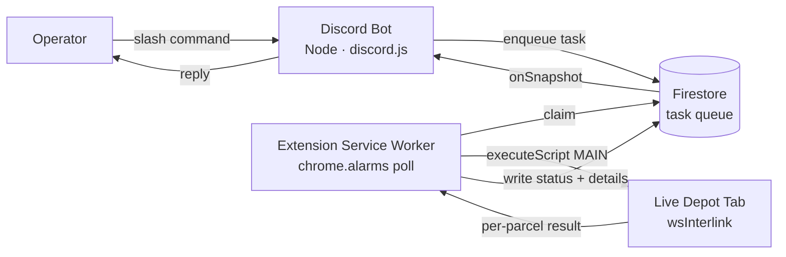

<div align="center">
  
  <h1>DPD Assistance</h1>
  <p><strong>Chrome Extension + Discord Bot · Logistics Automation · Computer Vision · AI</strong></p>

  
  
  
  
  
</div>

---

Automation toolkit for a **DPD Ireland parcel depot**, built around a real operational problem: the internal system has no batch tools, so every parcel reschedule is a separate sequence of clicks. This project replaces hours of manual clicking with one action — from the browser **or** from Discord.

It is a small **distributed system**: a Chrome MV3 extension does the work inside the live depot session, and a Discord bot drives it remotely. The two halves never call each other directly — they communicate through a shared Firestore task queue, so either side can be updated independently without breaking the other.

---

## Engineering Highlights

- **Two-process architecture over a shared queue.** Discord bot (Node) and Chrome extension (browser) exchange tasks via Firestore. A versioned contract keeps them decoupled; a version skew degrades gracefully instead of crashing.
- **Real-world computer vision.** Reads DPD labels from hand-held phone photos using local **ZXing-C++ WebAssembly** (PDF417 + Code128), with the proven JavaScript crop/rotation reader as a fallback; the current private 69-photo set remains **69/69 parseable** — plus a **Gemini Vision** fallback.
- **Works within MV3's hard limits.** The depot session lives in the tab URL (not cookies), so a service worker can't reach it alone; work is dispatched into the live tab via `executeScript` in the **MAIN world** (the depot rejects POSTs from an isolated world). The queue is polled with `chrome.alarms` because MV3 kills idle workers.
- **Secrets never ship.** The extension carries no service account; it authenticates to Firestore with **anonymous Firebase Auth** and is fenced off by security rules. All keys live in gitignored config, accessed through a single config facade.
- **Domain-correct logic.** Next-working-day calculation skips weekends and Irish bank holidays; delivery truth is read from scanning history, not the (often stale) arranged date.
- **Modular by default.** UI orchestrates, services hold business rules, adapters hide providers (Drive / Gmail / Gemini / Firestore) — swapping a provider touches one module. Bundled with **esbuild**, linted with **ESLint 9** flat config.

---

## What It Does

### 1 · Reschedule future-dated parcels
Scans the pending list, keeps only CAD-scanned parcels, computes the next valid working day (weekends + Irish holidays aware), and submits each reschedule in one action. **Dry-run mode** previews every change before anything is written.

### 2 · Scan parcel labels from Google Drive
Drivers photograph labels into a shared Drive folder; the extension reads each photo's barcode (ZXing, with Gemini Vision fallback), normalises standard 9-digit labels and legacy 8-digit parcel cards, verifies them in the depot, reschedules each exact verified consignment directly (without relying on Pending List), and files processed photos under `YYYY/MM`. Before a live reschedule it persists the exact targets locally; server errors can be retried from the popup or Discord on the same processing day without downloading Drive photos or decoding barcodes again. A previous-day recovery batch expires instead of being moved to a new "tomorrow".

> **Real label used during development:**
>
> 

### 3 · Control from Discord
A Discord bot exposes the same actions remotely and returns a **console-style per-parcel report** right in the channel:

```
/reschedule all       [dry_run]   → scan CAD list
/reschedule parcel    con_id new_date [dry_run]
/reschedule barcodes  [dry_run]   → scan Drive labels
/reschedule retry     [dry_run]   → retry today's saved server errors, no Drive scan
/find        con_id               → live parcel status + route map
/todo add|list|done|clear         → operator to-do list
```

`/reschedule barcodes` runs the same Drive adapter, ZXing parser, exact depot
verification, file naming, recovery queue, and reschedule rules as the popup.
The offscreen document supplies the DOM/canvas that MV3 service workers lack.
Long scans acknowledge immediately and send their final private report by DM;
Google Drive must first be authorized once from the extension popup.

`/reschedule parcel` first resolves exactly one consignment, then applies the
operator-selected future working date. It defaults to dry-run; explicitly
selecting `dry_run:false` confirms a live Save. Dates use `YYYY-MM-DD` in Discord
and are converted to the depot's `DD/MM/YYYY` only inside the executor.

`/find` looks up any consignment live and returns a rich card: status colour, full scan history, the straight-line distance between where the parcel was last scanned and its **Eircode** (resolved via Google Geocoding — Eircodes are proprietary, so OSM can't), and a route map. For a **multi-parcel** consignment it groups the scans per parcel and shows a `(delivered/total)` count with a per-parcel breakdown — so you can see at a glance that parcel 1 is delivered while parcel 2 is still at the depot.

Legacy eight-digit numbers require an explicit leading-zero marker in `/find`:
enter `0` followed by all eight digits. Bare eight-digit input is rejected; the
marker is removed only inside depot Quick Search. Normal 9- and 14-digit numbers
are searched unchanged, and ambiguous results still stop for manual review.

### 4 · Gmail auto-reply *(in progress)*
Reads a queued customer email, grounds the answer in live depot data (status, delivery date, address), and prepares a reply as a draft first — automation gated behind human review.

---

## System Architecture


```mermaid
flowchart LR
    U[Operator] -->|slash command| B[Discord Bot<br/>Node · discord.js]
    B -->|enqueue task| F[(Firestore<br/>task queue)]
    SW[Extension Service Worker<br/>chrome.alarms poll] -->|claim| F
    SW -->|executeScript MAIN| T[Live Depot Tab<br/>wsInterlink]
    T -->|per-parcel result| SW
    SW -->|write status + details| F
    F -->|onSnapshot| B -->|reply| U
```

---

## Tech Stack

| Layer | Technology |
|---|---|
| Extension | Chrome MV3, `chrome.scripting` (MAIN world), `chrome.alarms`, `chrome.identity` |
| Bot | Node.js, `discord.js` |
| Queue | Firebase Firestore (REST + anonymous Auth from the extension, Admin SDK from the bot) |
| Vision / OCR | `@zxing/library` (PDF417 · Code128) + Google Gemini Flash Vision |
| Google APIs | Drive v3, Gmail, OAuth 2.0 via `chrome.identity`; Geocoding + Maps Static (bot side) |
| Build / Quality | esbuild bundling, ESLint 9 flat config |
| UI | Vanilla JS + CSS (Apple-inspired) |

---

## Project Structure

```
src/                     # Chrome extension
├── background/          # Service worker — event wiring only
├── queue/               # Firestore listener: contract · adapter · executor
├── depot/               # Injected depot scripts, barcode + lookup logic
├── gmail/               # Gmail labels as a work queue
├── popup/               # UI (thin orchestrator + feature flows)
├── auth/  · config/  · utils/
bot/                     # Discord bot
└── src/                 # commands · queue · Firestore · todo
```

Each half is independently deployable: update the bot **or** the extension without touching the other, unless the shared queue contract itself changes.

---

## Roadmap

| Status | Milestone | Notes |
|:---:|---|---|
| ✅ | Reschedule future-dated parcels | CAD scan, dry-run, Irish-holiday aware |
| ✅ | Drive label scanning | ZXing + Gemini, 69/69 on the current private validation set, auto-filing |
| ✅ | Discord bot + Firestore queue | `/reschedule`, `/todo`, distributed contract |
| ✅ | Extension queue listener | service-worker poll → depot tab → result |
| ✅ | Console-style per-parcel reports in Discord | dry-run list + live actions |
| ✅ | `/find` live parcel lookup | status, Eircode distance, route map, multi-parcel `(x/n)` |
| ✅ | `/reschedule parcel` executor | exact lookup + chosen-date dry-run/live reschedule |
| ✅ | `/reschedule barcodes` executor | offscreen Drive/ZXing scan + ephemeral progress bar + private DM result |
| 🚧 | Gmail auto-reply | depot-grounded drafts, human-in-the-loop |
| 📋 | Delivery verification | delivered-vs-expected → mini-report in Discord |
| 📋 | Carrier adapter layer | swap DPD for another carrier without touching logic |
| 📋 | Processing history | timestamped audit log of every reschedule |

---

## Setup

**Extension**
1. `npm install` → `npm run build` (bundles to `dist/`)
2. `chrome://extensions` → **Developer mode** → **Load unpacked** → select `dist/`
3. Copy `src/config/local.example.js` → `local.js`; add Gemini key, Drive folder, and Firebase web config (`apiKey`, `projectId`)

**Bot**
1. `cd bot && npm install`
2. Copy `config/local.example.js` → `local.js`; add the Discord token and Firebase service account
3. `npm start`

> OAuth consent is handled by the signed-in Chrome profile — no manual token setup. All secrets stay in gitignored `local.js`.

---

## Why I Built This

I work at a DPD Ireland depot. The management system has no batch tooling, so I built one — and used it as a testbed for production-shaped problems: MV3 constraints, OAuth, a distributed queue with a clean contract, and applied computer vision on genuinely messy real-world images.

---

*Chrome MV3 · Discord.js · Firebase · ZXing · Google Gemini · Google APIs*
